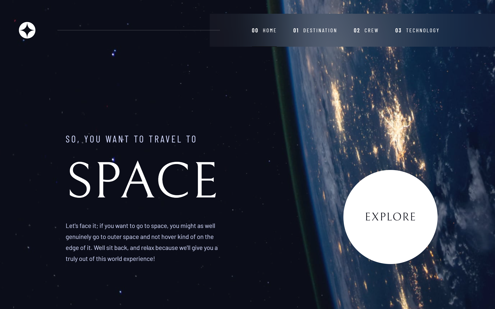
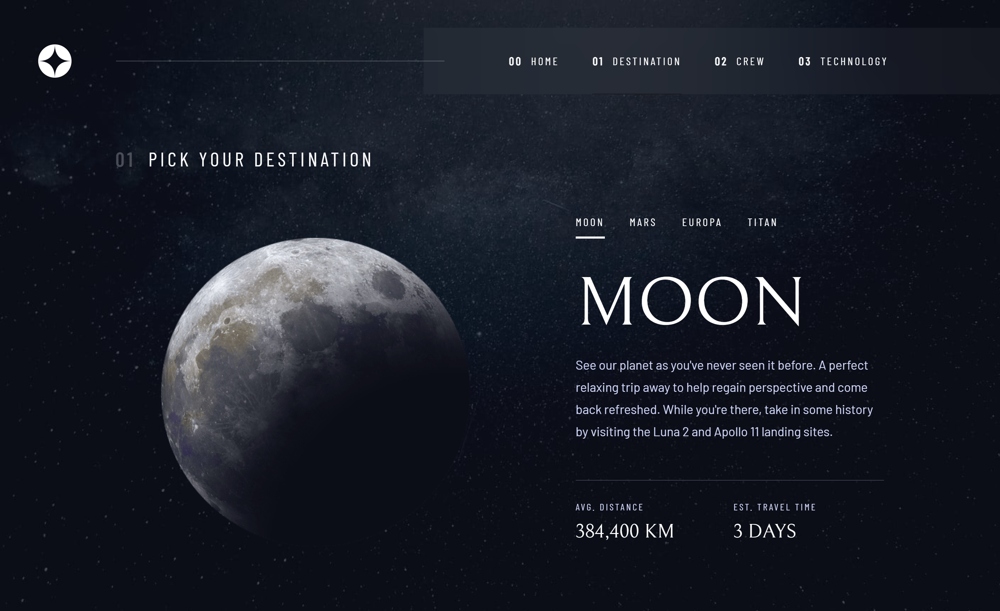
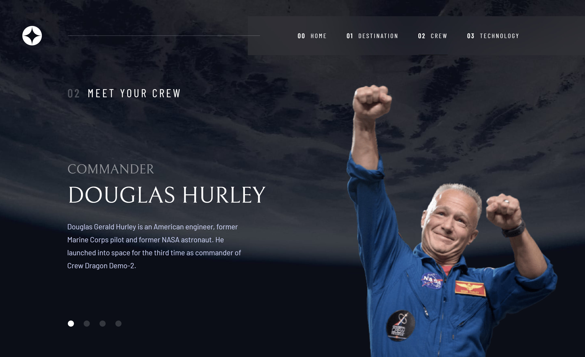
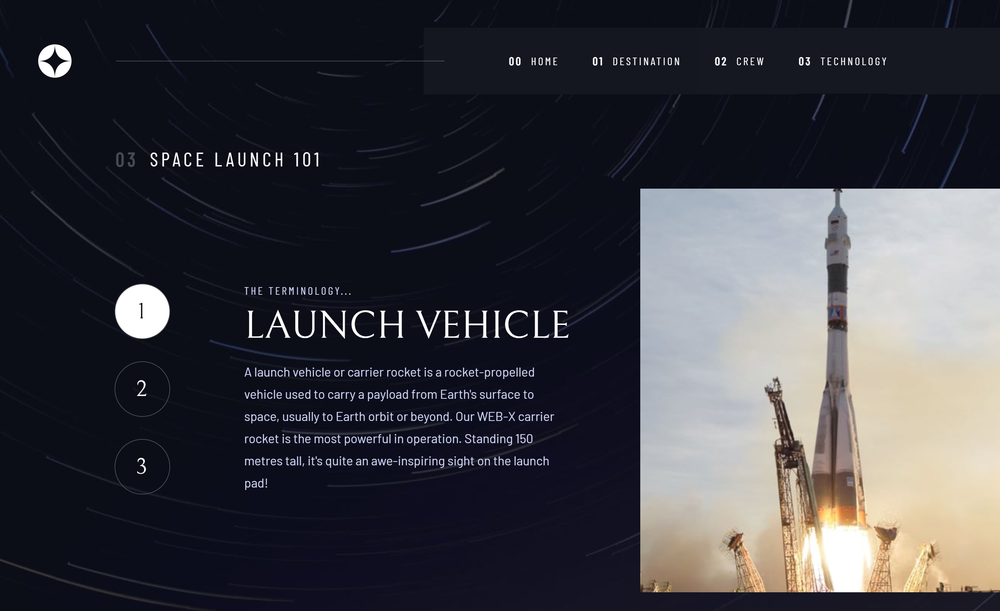
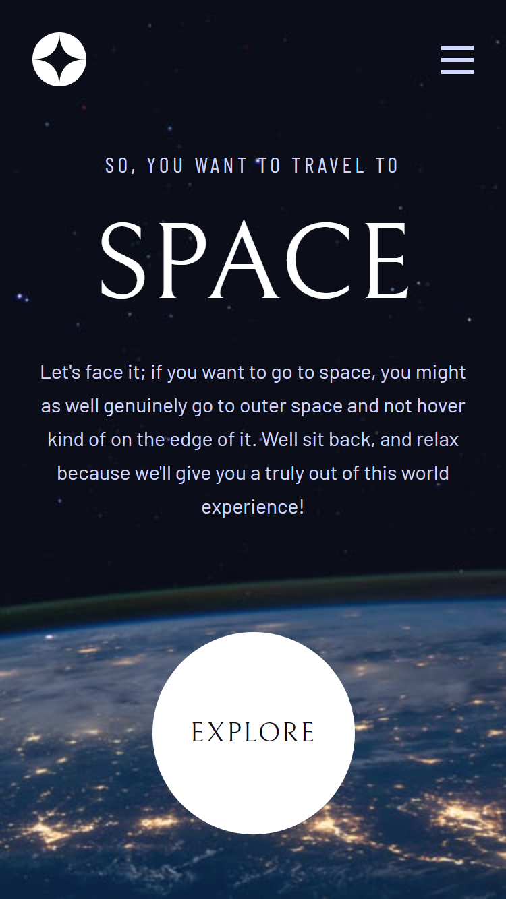
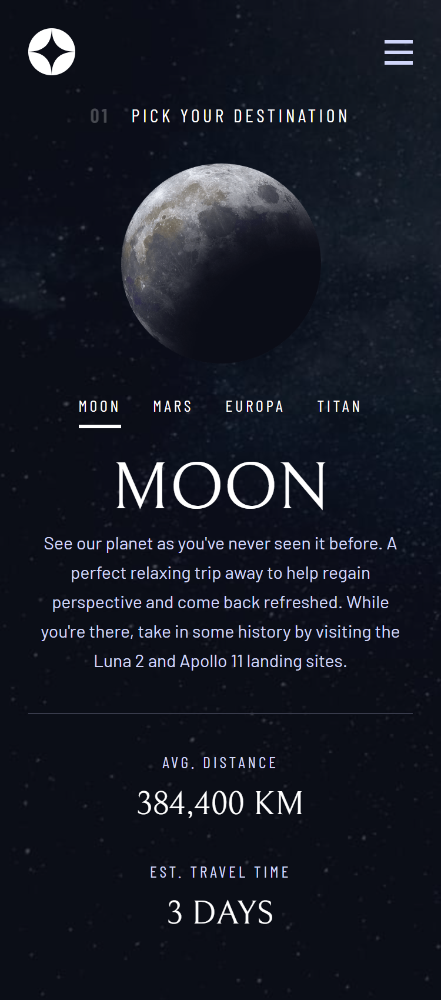
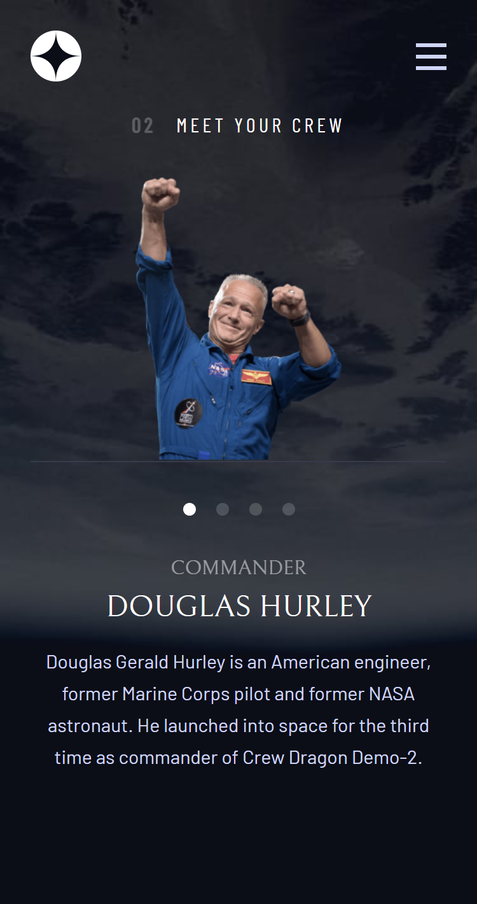
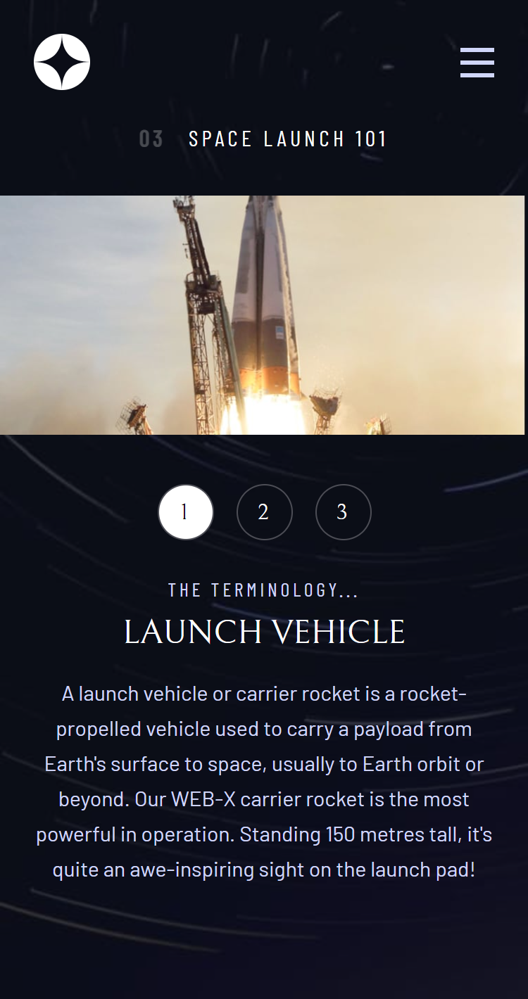

# Frontend Mentor - Space tourism website solution

This is a solution to the [Space tourism website challenge on Frontend Mentor](https://www.frontendmentor.io/challenges/space-tourism-multipage-website-gRWj1URZ3). Frontend Mentor challenges help you improve your coding skills by building realistic projects. 

## Table of contents

- [Overview](#overview)
  - [The challenge](#the-challenge)
  - [Screenshot](#screenshot)
  - [Links](#links)
- [My process](#my-process)
  - [Built with](#built-with)
  - [Getting started](#getting-started)
  - [Useful resources](#useful-resources)
- [Author](#author)


## Overview

### The challenge

Users should be able to:

- View the optimal layout for each of the website's pages depending on their device's screen size
- See hover states for all interactive elements on the page
- View each page and be able to toggle between the tabs to see new information

### Screenshot

#### Desktop

- Page Home



- Page Destination



- Page Crew



- Page Technology




#### Mobile

- Page Home



- Page Destination



- Page Crew



- Page Technology



### Links

- Solution URL: [Github](https://github.com/Makson19/space-tourism-website)
- Live Site URL: [Vercel](https://your-live-site-url.com)

## My process

### Built with

- Semantic HTML5 markup
- CSS custom properties
- Flexbox
- CSS Grid
- Mobile-first workflow
- [React](https://reactjs.org/) - JS library
- [Styled Components](https://styled-components.com/) - For styles


### Getting started

Clone the project and access the folder.

```git
git clone https://github.com/Makson19/space-tourism-website.git

cd space-tourism-website
```

Run this command to install the dependencies.

```js
npm install

npm start
```

### Useful resources

- [Animations Library](https://formidable.com/open-source/react-animations/#:~:text=A%20collection%20of%20animations%20that,implements%20all%20animations%20from%20animate.) - I used this library to create the website animations.


## Author

- Frontend Mentor - [@Makson19](https://www.frontendmentor.io/profile/Makson19)
- Github - [Makson19](https://github.com/Makson19)
- Codepen - [@Makson19](https://codepen.io/Makson19)

